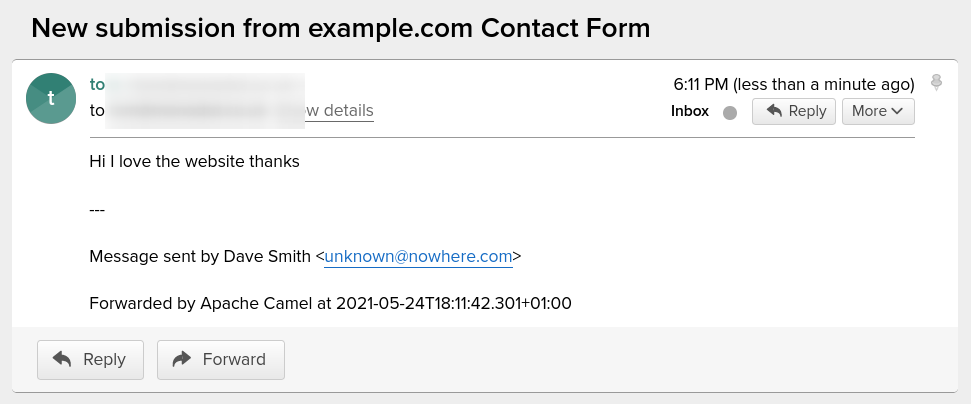

<h1 align="center">
    
    <br/>
    camel-form-emailer
</h1>

This Java application uses [Apache Camel][camel] to expose an API to receive and process HTML form submissions. The app saves each submission to a database, and then it sends an email.

The app is intended to provide a contact form handling service to an existing website.

Once a submission has been processed, the application returns an HTTP `Location` header, to redirect a web browser to a success or failure message (you will need to provide these).

This application uses [Quarkus][quarkus], the Supersonic Subatomic Java Framework.

For more info on this app and how it was created, read the accompanying blog post at [tomd.xyz][1].

## Go explore

- 🐪 Have a look at the Apache [Camel routes][routes] in [FormEmailerRouteBuilder.java](/src/main/java/xyz/tomd/FormEmailerRouteBuilder.java)
- 🔨 See the unit tests in [FormEmailerRouteBuilderTest.java](src/test/java/xyz/tomd/FormEmailerRouteBuilderTest.java)
- 🍎 See how the application is configured in [application.properties](src/main/resources/application.properties)

## Getting started (Local)

The application saves form submissions to a [SQLite][sqlite] database, which is basically a file. The database file isn't included with this repo, so you need to initialise the database file first. 

### 1. Install and set up SQLite database

**Firstly,** install the `sqlite3` CLI tool on your operating system:

- [How to install SQLite on MacOS][flavio]
- [How to install SQLite on Ubuntu][ubuntu]
- [SQLite Download page (for Windows and other platforms)][sqlite-download]

Then, use the `.sql` script in _src/main/resources/_ to initialise a new database file in _target/_. Here's how to do it on MacOS/Linux:

```
mkdir -p target/
cat src/main/resources/init_db.sql | sqlite3 target/submissions.db
```

(The database file is in _target/_, because that is the directory where the application will run from. If you prefer, you can put the database file somewhere else.)

### 2. Configure the application

Next, configure the application with the details of your SMTP server, database file name, and other properties. Edit the file _src/main/resources/application.properties_. 

e.g.:

```
# Where should the user be redirected to, after a successful or failed submission?
redirect.success=https://example.com/thankyou
redirect.fail=https://example.com/didnotsend

# A comma-separated list of mandatory fields in the form submission
fields.required=name,email,message

# What is the answer to the antispam question?
antispam.answer=0

# Complete this, filling in the hostname, username and password to the SMTP server
smtp.uri=smtps:smtp.example.com:465?username=postmaster@example.com&password=xxxxxx

# Properties of the email
mail.to=yourinbox@example.com
mail.from=the.website@example.com
mail.subject=New submission from example.com Contact Form

# If you wish to use a different database, change these settings
quarkus.datasource.db-kind=other
quarkus.datasource.jdbc.driver=org.sqlite.JDBC
quarkus.datasource.jdbc.url=jdbc:sqlite:submissions.db
```

You can also provide a separate _application.properties_ file in `$PWD/config`. [See the Quarkus documentation][quarkus-config] for more info on how this works.

### 3. Run locally with Maven and Curl

Now you're ready to run the app locally. You will need Maven installed. Run the app in dev mode, with Live Coding enabled:

```
./mvnw compile quarkus:dev
```

Since Live Coding is enabled, you can make changes to the code, and the app will be reloaded automatically.

**_NOTE:_**  Quarkus also ships with a Dev UI, which is available in dev mode only at http://localhost:8080/q/dev/.

Now make a request to the API, using cURL:

```
curl -X POST \
    -d name=Dave+Smith \
    -d email=unknown@nowhere.com \
    -d message=Hi+I+love+the+website+thanks \
    -d antispam=0 \
    http://localhost:8080/
```

#### Email received

If you've configured everything correctly, and your SMTP server sends the email, you should receive an email in your inbox!

<p align="center"></p>

#### Submission saved in database

You will also see an entry saved into the SQLite database file. You can get all rows in the `responses` table like this:

```
sqlite3 target/submissions.db "select * from responses"
```

Here's the response:

```
1|Dave Smith|unknown@nowhere.com|Hi I love the website thanks|2021-05-24T18:11:42.301+01:00
```

## Packaging and running the application

The application can be packaged using:
```shell script
./mvnw package
```
It produces the `quarkus-run.jar` file in the `target/quarkus-app/` directory.
Be aware that it’s not an _über-jar_ as the dependencies are copied into the `target/quarkus-app/lib/` directory.

If you want to build an _über-jar_, execute the following command:
```shell script
./mvnw package -Dquarkus.package.type=uber-jar
```

The application is now runnable using `java -jar target/quarkus-app/quarkus-run.jar`.

## Creating a native executable

You can create a native executable using: 
```shell script
./mvnw package -Pnative
```

Or, if you don't have GraalVM installed, you can run the native executable build in a container using: 
```shell script
./mvnw package -Pnative -Dquarkus.native.container-build=true
```

You can then execute your native executable with: `./target/camel-form-emailer-1.0.0-SNAPSHOT-runner`

If you want to learn more about building native executables, please consult https://quarkus.io/guides/maven-tooling.html.


[1]: https://tomd.xyz
[flavio]: https://flaviocopes.com/sqlite-how-to-install/
[sqlite]: https://www.sqlite.org/index.html
[camel]: https://camel.apache.org/
[quarkus]: https://quarkus.io/
[sqlite-download]: https://www.sqlite.org/download.html
[ubuntu]: https://www.digitalocean.com/community/tutorials/how-to-install-and-use-sqlite-on-ubuntu-20-04
[quarkus-config]: https://quarkus.io/guides/config-reference#pwd_config_application_file
[routes]: https://tomd.xyz/camel-routes/
